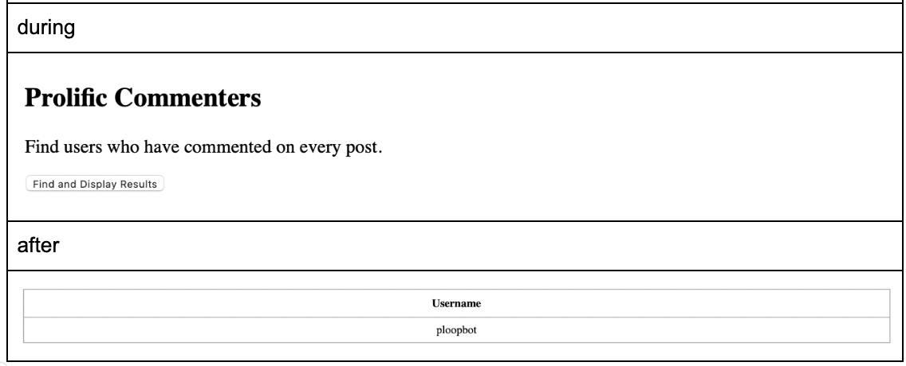

# Connectopia -- Admin Database Query UI 

Welcome to “Connectopia," a social media application. It is a digital space for users to express themselves, interact with others and celebrate the richness of their communities. The domain of this project is a social media platform consisting of users, bots, customer support, and site moderators/administrators.
The core features of our social media are built around entities such as “Feeds,” "Posts," "Comments," and "Events." Site admins will be able to create feeds, meaning categories such as sports or news, in which users will be able to create public posts of different types that other users will be able to vote and comment on. Comments should be identified based on the post they are written to. Users can also create events that other users will be able to RSVP to, which don’t belong to any feed as events will be categorized on their own. 
 

For communication purposes, users will be able to create private chats modelled by the “Message” and “Chat” entities. Chats can contain one or many users, and users should only be able to send chat messages to chats that they are a part of.
To determine user roles and permissions, we've introduced the "PGroup" and "Permission" entities. Each user is assigned to one or more permission groups that allow them to perform a specified set of actions as defined by the group’s permission nodes. Higher-level administrators will be assigned to groups whose permissions give them the authority to oversee user behavior and enforce appropriate conduct, including the ability to ban other users and delete posts if they contain inappropriate content. Customer support teams will also have access to dialogue history to solve technical issues.
Finally, Bots are a type of user that can be leveraged by human users to automatically perform actions such as moderating chat and posts. They have a token that can be used to access them through the site’s API, and a required url linking to the bot’s documentation.
 

For this project, the features above will be modelled using the Oracle database with PHP for this project. As well as a GUI is implemented for the users (intended for the admins) with queries capable of managing events by searching, creating, or editing them. The admins can also search for messages and delete feed to supervise and enforce community guidelines. Furthermore, we included specific queries that allow the admins to analyze top users in certain fields, such as Best Commenters with high comment scores, Quality Posters with higher-than-average post scores, or Prolific Commenters who commented on every single post. Finally, the admin can use projection to find all records about all attributes across all relations. Overall, giving admins access to supervise, manage, and analyze Connectopia social media in hopes of improving it for the community!

# Demonstration of All Queries Functionality: 
## Insert: 

## Delete: 

## Update: 

## Selection: 

## Projection: 

## Join:  

## Group By:  

## Group By Having:  

## Group By Having (Nested):  

## Division:  
  
